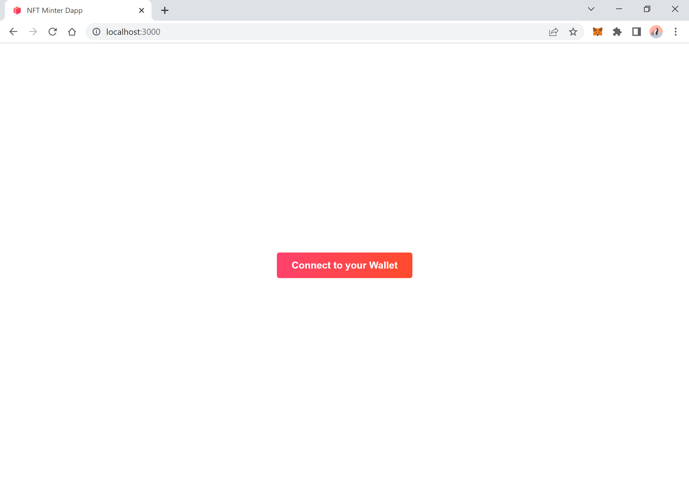
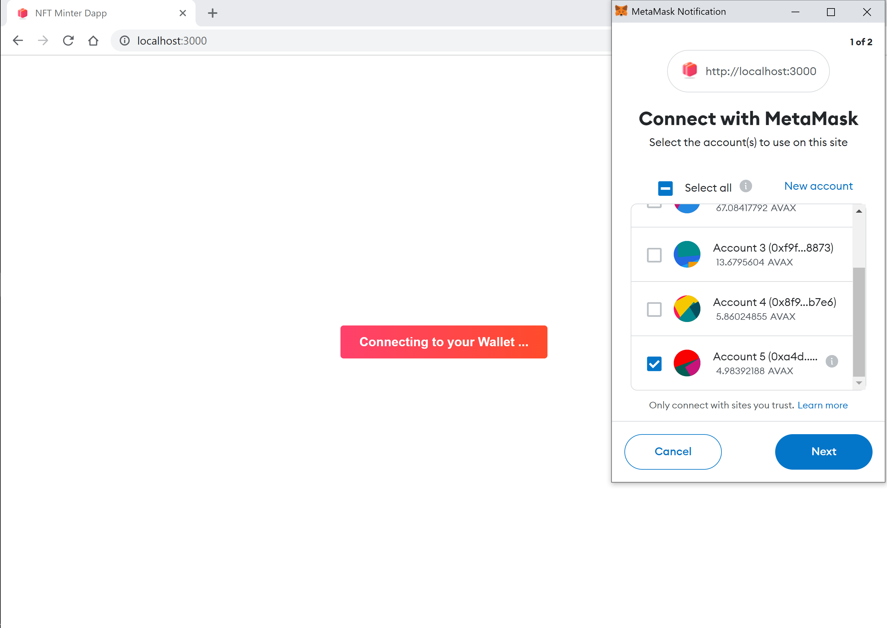
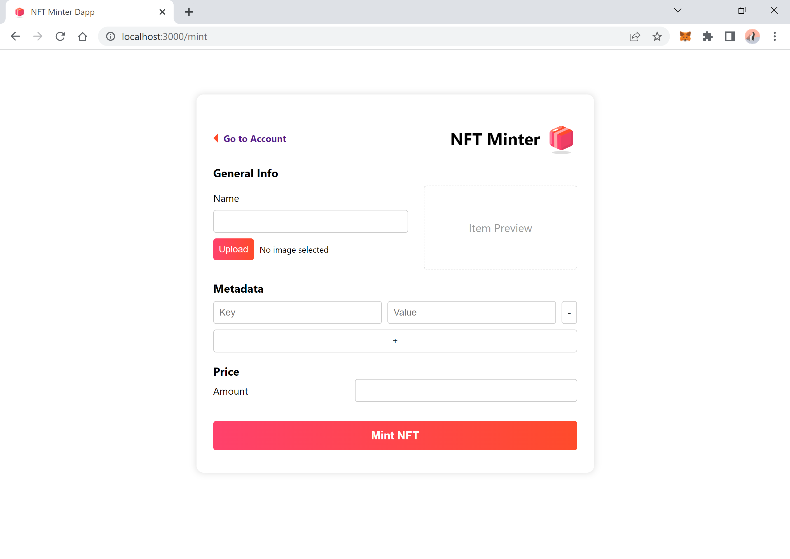
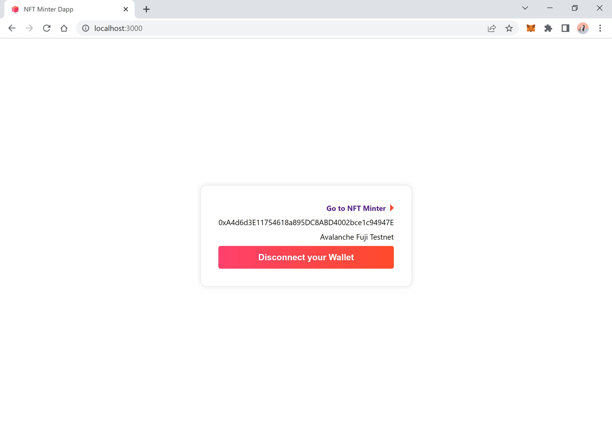
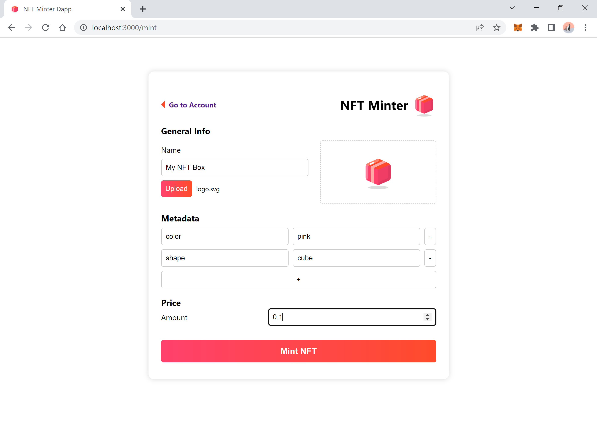
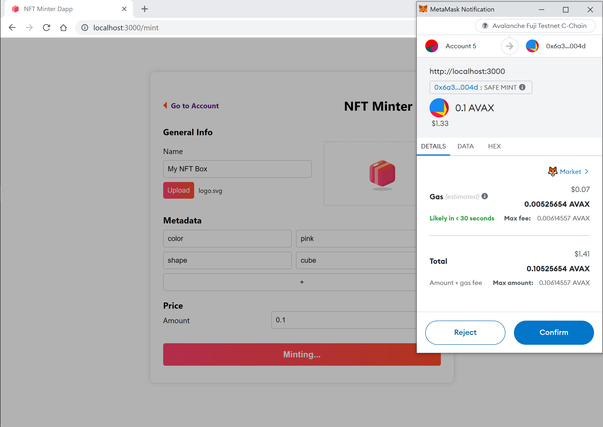
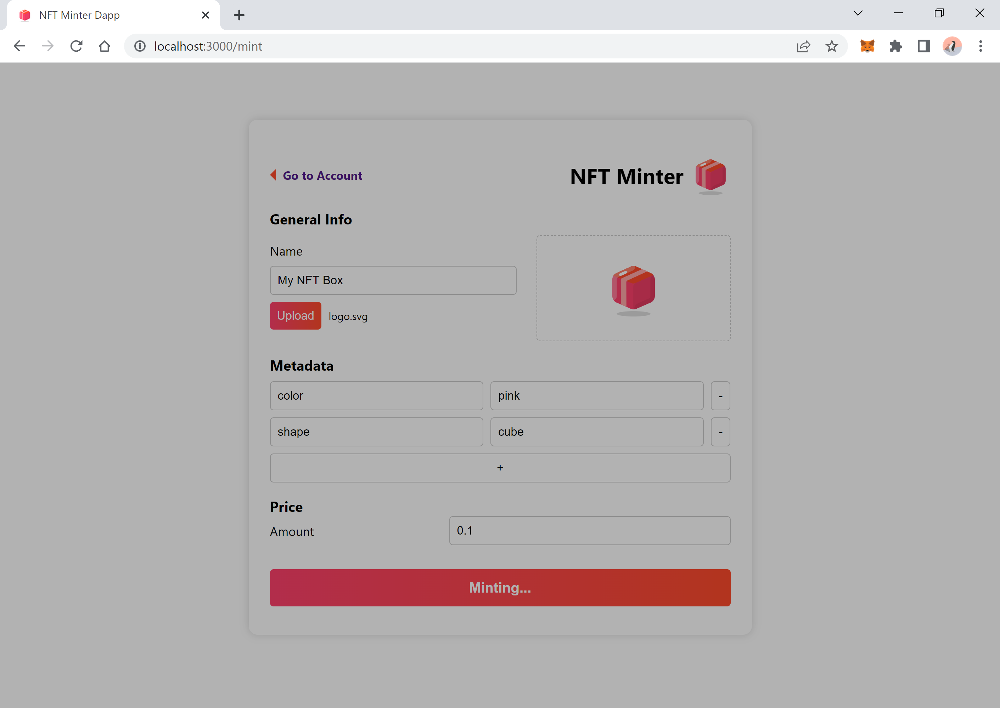
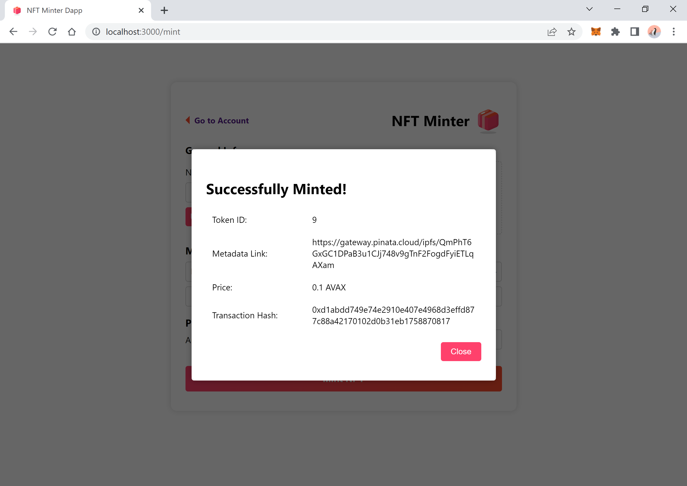

# NFT Minter Dapp

### Summary
The NFT Minter app allows users to mint their own Non-Fungible Tokens (NFTs) on the blockchain. It is a web application with a basic backend that facilitates the interaction between the blockchain system and the user interface.  
The project is implemented using React, a popular JavaScript library for building user interfaces. It utilizes React's state management capabilities to handle form inputs and dynamically update the UI based on user interactions.

#### Key Features

- Two pages: a welcome page for connecting to a wallet and a minter page for minting NFTs.  
- The minimum required inputs are the name of the NFT and the NFT file itself. Metadata is optional but can be used to provide additional information about the NFT. Both the metadata and the NFT binary are stored off-chain on IPFS.  
- The smart contracts used for minting the NFTs are based on the ERC-721 token standard and are implemented using Solidity.  
- The Avalanche Fuji Testnet is the designated network for this application.

#### Tokenomics

- The application incorporates two wallets on the blockchain side: a liquidity wallet and a treasury wallet.  
- A royalty fee of 10% is applied to the minted NFTs. Out of this fee, 6% is transferred to the treasury wallet and 4% to the liquidity wallet.  

--- 

### Getting Started

#### Project Setup

```bash
# clone the repository

# install dependencies.
npm install 

# set private key and network variables inside the .env file. 

# deploy the smart contracts to the Avalanche Fuji Testnet.
npx hardhat run scripts/deploy.js --network fuji 

# copy contract address to .env file.
# copy the abi from generated artifacts/NFTMinter.json to 
# src/contracts/NFTMinter.json.
# set the rest of the .env variables.

# start the development server.
npm start 
```


#### Project Structure

```bash
.  
├── artifacts      # Compiled artifacts will be saved in this directory by default.
├── contracts      # NFTMinter.sol smart contract
├── public  
├── scripts        # Deploying the smart contract using deploy.js script
├── screenshots    # App screenshots
├── src  
│   ├── abi        # ABI of deployed NFTMinter contract
│   ├── assets     # Images
│   ├── constants  # Network and Pinata settings
│   ├── context    # Metamask Provider
│   ├── layouts    # Login and Mint pages
│   ├── services   # Auth and Web3 Services
│   ├── utils      # IPFS operations
│   ├── App.css    
│   ├── App.js     # Routes
│   ├── index.css  
│   └── index.js   
├── .env               
├── .gitignore
├── hardhat.config.js   
├── package-lock.json
├── package.json
└── README.md
```  


#### Dependencies 
- `hardhat` `@nomicfoundation/hardhat-toolbox` bundles all the commonly used packages and Hardhat plugins to start developing with Hardhat.  
- `@openzeppelin/contracts` is a library for secure smart contract development.   
- `ethers` is a complete and compact library for interacting with the Ethereum Blockchain and its ecosystem.  
- `axios` is a promise-based HTTP Client for node.js and the browser. it is used for sending files to IPFS through **Pinata**’s easy to use REST API.


### Screenshots

  
  
  
  
  
  
  
  


## Bonus 
 
> In this project there are 2 wallets on the blockchain side to build some basic tokenomics. Liquidity wallet and treasury wallet.   
> We have a royalty fee on the backside. It should be %10 off your price.   
> When the user mint the NFT, 6% of 10% will be transferred to the treasury wallet, 4% to the liquidity wallet.  
> Imagine that the liquidity wallet/pool is our staking reward resource. If we want to calculate a daily annual percentage rate (a.k.a. APR) here and show it to users in a way that will not make loss our money, what kind of algorithm is set up? 


To calculate the `daily annual percentage rate` `(APR)` for the staking rewards provided by the liquidity wallet/pool in a tokeneconomic model, we would need to consider various factors such as the total value locked in the pool, the duration of staking, and the distribution of rewards. 

Here's a simplified explanation:

1. **Total Value Staked**: Retrieve the total amount of tokens currently staked (locked) in the liquidity wallet/pool.  

2. **Total Reward**: Determine the total reward generated by the royalty fee. In our case, 10% of the NFT price is collected as a royalty fee. From that, 6% goes to the treasury wallet and 4% goes to the liquidity wallet.  

3. **Reward Distribution Period**: Define the duration over which the rewards are distributed. This could be a day, a week, a month, or any other timeframe.  

4. **Daily Reward**: Divide the total reward by the reward distribution period. This will give you the daily reward generated by the liquidity pool. 

5. **Daily APR**: Divide the daily reward by the total value staked and multiply by 100 to get the percentage. This will give you the daily Annual Percentage Rate (APR) for the liquidity pool.  

6. **Annual APR**: Multiply the daily APR by 365 (number of days in a year) to get the annualized APR. This will provide an estimate of the annual return for staking in the liquidity pool.

Here's an example:

Assuming the TVL is $100,000, and the daily reward generated is $1,000, the calculation would be as follows:

```javascript
// Step 1: Total value staked in the liquidity pool
const totalValueStaked = 100000; 

// Step 2: Total reward generated
const totalReward = 1000; 

// Step 3: Reward distribution period in days
const rewardDistributionPeriod = 1; 

function calculateAPR(totalValueStaked, totalReward, rewardDistributionPeriod) {
  // Step 4: Calculate the Daily Reward
  const dailyReward = totalReward / rewardDistributionPeriod;

  // Step 5: Calculate the Daily APR
  const dailyAPR = (dailyReward / totalValueStaked) * 100;

  // Step 6: Calculate the Annual APR
  const annualAPR = dailyAPR * 365;

  return annualAPR;
}

const apr = calculateAPR(totalValueStaked, totalReward, rewardDistributionPeriod);

console.log(`Annual APR: ${apr}%`);

```

```
Daily APR = (Daily Reward / Total Value Staked) * 100
= ($1,000 / $100,000) * 100
= 1%

Annual APR = Daily APR * 365
= 1% * 365
= 365%
```

So, in this example, the estimated annual APR for the liquidity pool would be 365%.

Please note that this is a simplified explanation, and the actual calculation and parameters may vary based on your specific implementation and requirements.